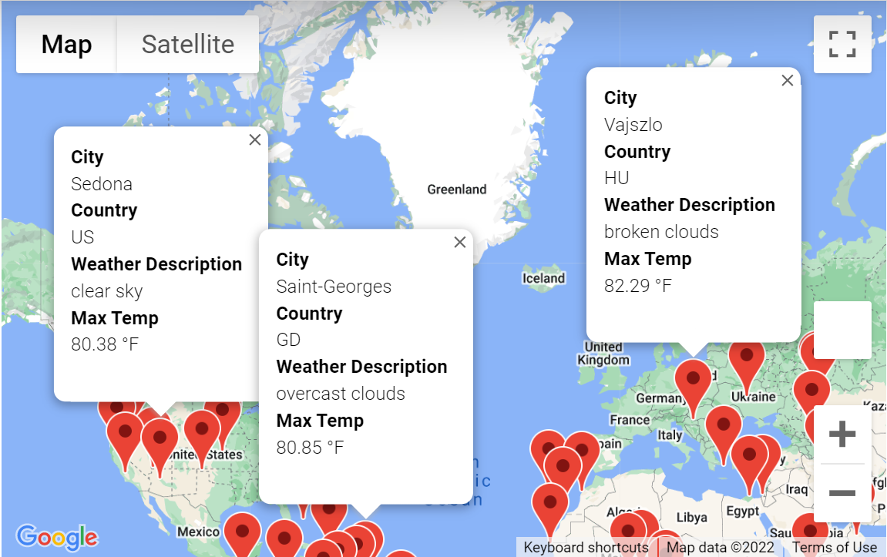
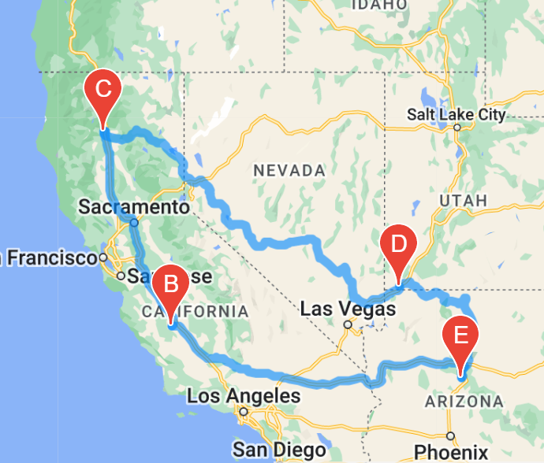
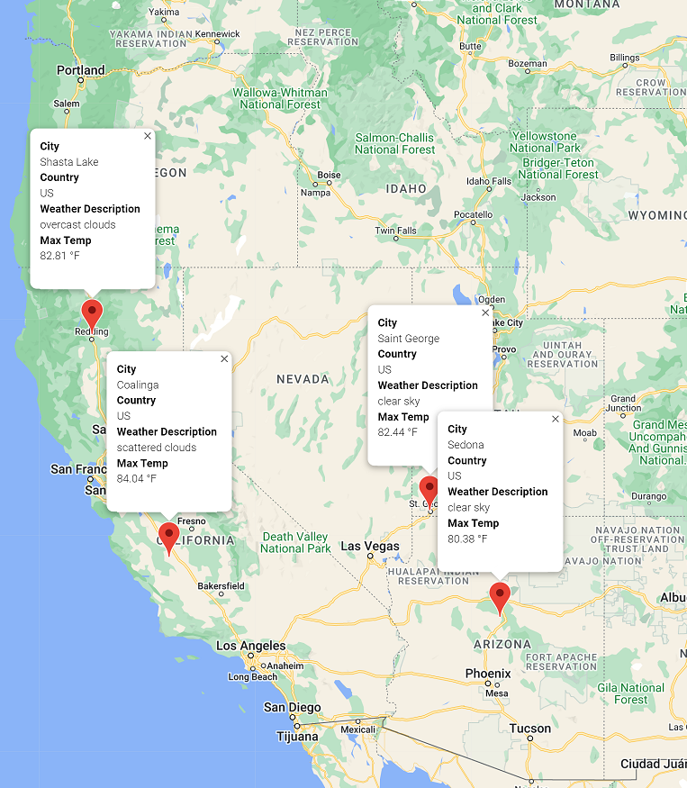

# World_Weather_Analysis

## Project Objective

The Objective of this project was to create an application that would allow the user to plan a vacation to visit different destinations and plan an itinerary based on temperature requirements set by the user. This was accomplished by creating a random list of cities using the Python citipy module and then making a call to the API of the OpenWeatherMap. The next step was to locate cities with pop-up markers within Google Maps API. Using the Google API's nearby feature, I located the closet hotel to the coordinates we found and added that to our DataFrames. We then created a means of allowing the user to select four cities to travel through in an itinerary and mapped that out as well using Google maps. Finally, we set markers with information for the four cities for the user to review.

Please see the project images and files below.

Jupyter Notebook Files containing the code:
Deliverable 1:

[Vacation_Search.ipynb](./Vacation_Search/Vacation_Search.ipynb)

Deliverables 2 & 3:

[Vacation_Itinerary.ipynb](./Vaction_Itinerary/Vacation_Itinerary.ipynb)

Initial map of all cities located using citipy on Google Maps:

Map of selected cities with itinerary shown on Google Maps:

Map of selected cities using markers with info shown on Google Maps:

